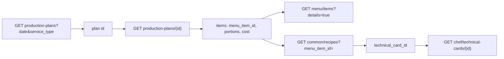

# Dev: production plans и техкарты (seed 2026-06-03)

Краткая расшифровка подсказки бэкенда для QA и экрана «Меню» (дашборд).

## Авторизация

```http
POST /api/v2/public/otp/verify
```

| Роль        | Телефон        | OTP    |
|-------------|----------------|--------|
| Chef        | +79000000005   | 111111 |
| Supervisor  | +79000000003   | 111111 |

Без токена chef/supervisor endpoints вернут 401/403.

## Модель данных на один день

На **одну дату** и **один приём пищи** — **один production plan** (отдельная сущность с id).

Для **2026-06-03** в seed:

| service_type | plan id |
|--------------|---------|
| breakfast    | 992121  |
| lunch        | 992122  |
| dinner       | 992123  |

Список без `service_type` вернёт до трёх планов; с `service_type=lunch` — обычно один (992122).

## Цепочка для дашборда меню



1. **Список планов** — `GET /chef/production-plans?date=2026-06-03&service_type=lunch&page_size=50`  
   Нужен id плана на день + приём пищи.

2. **Деталь плана** — `GET /chef/production-plans/992122`  
   Позиции меню: `menu_item_id`, порции, статус, `theoretical_cost` по строкам.

3. **Теория (опционально)** — `GET /chef/production-plans/992122/theoretical`  
   Снимок теоретических количеств/стоимости по ингредиентам плана (отчёты, food cost).

4. **Каталог** — `GET /menu/items?details=true&page_size=50`  
   Имена блюд, цены, флаги — если в плане только id.

5. **Связь блюдо → техкарта** — `GET /common/recipes?menu_item_id=990301`  
   Предпочтительнее поиска техкарты по имени.

## Техкарта (редактор)

| Метод | Назначение |
|-------|------------|
| `GET /chef/technical-cards/992001` | Полная карта с ингредиентами |
| `GET .../history` | Журнал изменений |
| `GET .../versions` | Версии |
| `PATCH .../992001` | Сохранение правок (клиент уже шлёт при Save) |

Пример id техкарты в seed: **992001**.

## Что делает клиент MEZZOME

- Дашборд недели: для выбранного приёма (завтрак/обед/ужин) — **6×** `production-plans?date=&service_type=&page_size=50`, затем **6×** `production-plans/{id}`.
- Экран списка блюд на день (`dishes_notifier`): без `service_type` — все планы за дату (все приёмы).
- Owner: по-прежнему 403 на chef/supervisor → fallback `GET /owner/menu/items`.

## Быстрая проверка в curl

После verify подставьте `Authorization: Bearer <token>`:

```bash
curl -s "$BASE/api/v2/chef/production-plans?date=2026-06-03&service_type=lunch&page_size=50"
curl -s "$BASE/api/v2/chef/production-plans/992122"
curl -s "$BASE/api/v2/chef/technical-cards/992001"
```
